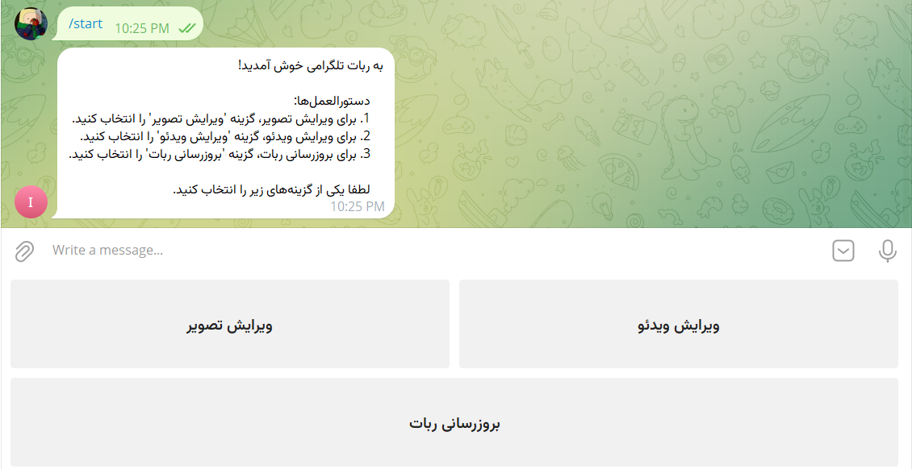
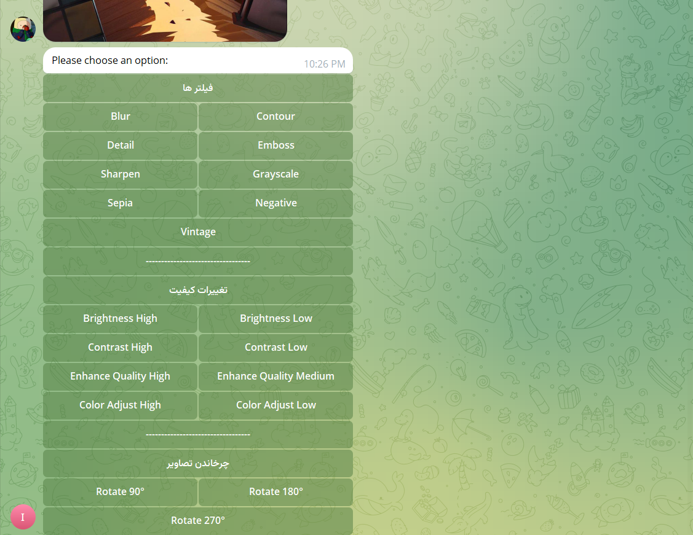
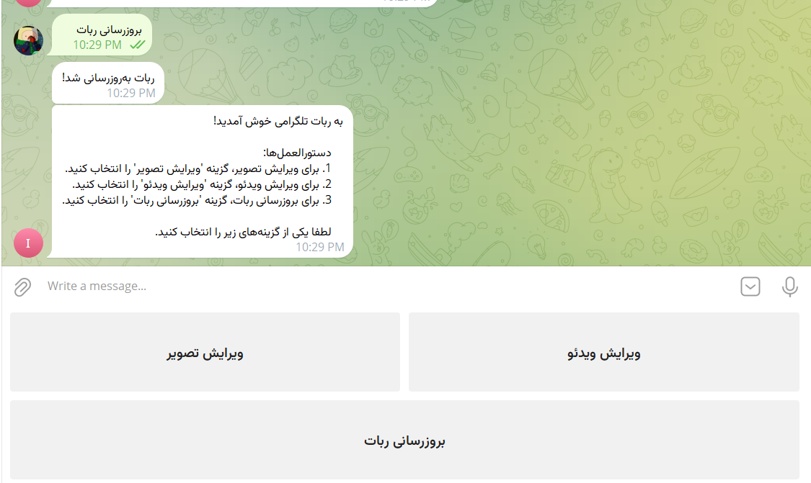

# Telegram Image and Video Editor Bot  
A Telegram bot for editing images and videos with various filters and functionalities, built using Python, `python-telegram-bot`, Pillow, and moviepy.  
This bot supports Persian and provides an intuitive interface for users to:  
- Apply image filters  
- Adjust quality  
- Rotate and resize images  
- Convert videos to MP3  
- Trim videos by start/end times  

## Features  

### Image Editing  
- Filters: Blur, Contour, Detail, Emboss, Sharpen, Grayscale, Sepia, Negative, Vintage  
- Quality Adjustments: Brightness, Contrast, Color, Sharpness  
- Resize and Rotate images  

### Video Editing  
- Convert video to MP3  
- Trim video by specifying start and end times  

### Persian Interface  
- Fully supports Persian language for user interaction  

### Inline Keyboard  
- Easy-to-use inline buttons for selecting editing options  

## Prerequisites  
- Python 3.8 or higher  
- FFmpeg installed on your system (required for moviepy video processing)  
- A Telegram Bot Token from BotFather  

## Installation  

1. Clone the repository:  
   git clone https://github.com/keyvan-alavi/ImageAndVideoEnhancerTelegramBot.git  
   cd telegram-image-video-editor-bot  

2. Install dependencies:  
   pip install -r requirements.txt  

3. Install FFmpeg:  
   - Ubuntu: sudo apt-get install ffmpeg  
   - 	Install FFmpeg on your system (for video processing with moviepy)
   - 	In case of upgrading the video editing section
   -  Windows: Download from FFmpeg website and add to PATH  

4. Create `.env` file and add your bot token:  
   TELEGRAM_TOKEN=your_bot_token_here  

5. Run the bot:  
   python bot.py  

## Usage  

1. Start the bot by sending /start in Telegram  
2. Choose "Edit Image" or "Edit Video" from the menu  

For image editing:  
- Send an image and select a filter or adjustment option from the inline keyboard  

For video editing:  
- Send a video and choose to convert it to MP3 or trim it by specifying start/end times (e.g., 00:00:10-00:00:20)  

Tip: Use "Update Bot" to refresh the menu  

## Screenshots  
- Main Menu:  
    

- Image Editing Options:  
    

- Video Editing Options:  
    

## License  
This project is licensed under the MIT License. See the full license text below.  

## Contributing  
Contributions are welcome! Please open an issue or submit a pull request for any improvements or bug fixes.  

## Contact  
For any questions or suggestions, feel free to open an issue on GitHub or contact the developer via Telegram https://t.me/kewin22.  

------------------------------------------------------------

# ربات ویرایشگر تصویر و ویدئو تلگرام  
رباتی تلگرامی برای ویرایش تصاویر و ویدئوها با فیلترها و قابلیت‌های متنوع، ساخته‌شده با پایتون و کتابخانه‌های `python-telegram-bot`، Pillow و moviepy.  
این ربات از زبان فارسی پشتیبانی می‌کند و رابط کاربری ساده‌ای برای:  
- اعمال فیلترهای تصویر  
- تنظیم کیفیت  
- چرخش و تغییر اندازه تصاویر  
- تبدیل ویدئو به MP3  
- برش ویدئو با تعیین زمان شروع و پایان  

## قابلیت‌ها  

### ویرایش تصویر  
- فیلترها: بلور، کانتور، دیتیل، امباس، شارپن، خاکستری، سپیا، نگاتیو، وینتیج  
- تنظیمات کیفیت: روشنایی، کنتراست، رنگ، وضوح  
- تغییر اندازه و چرخش تصاویر  

### ویرایش ویدئو  
- تبدیل ویدئو به MP3  
- برش ویدئو با تعیین زمان شروع و پایان  

### رابط کاربری فارسی  
- پشتیبانی کامل از زبان فارسی برای تعامل با کاربر  

### کیبورد اینلاین  
- دکمه‌های ساده و کاربردی برای انتخاب گزینه‌های ویرایش  

## پیش‌نیازها  
- پایتون نسخه ۳.۸ یا بالاتر  
- نصب FFmpeg روی سیستم (برای پردازش ویدئو با moviepy) - در صورت ارتقا بخش ویرایش ویدئو 
- توکن ربات تلگرام از BotFather  

## نصب  

۱. کلون کردن مخزن:  
   git clone https://github.com/keyvan-alavi/ImageAndVideoEnhancerTelegramBot.git  
   cd telegram-image-video-editor-bot  

۲. نصب وابستگی‌ها:  
   pip install -r requirements.txt  

۳. نصب FFmpeg:  
   - اوبونتو: sudo apt-get install ffmpeg  
   - مک: brew install ffmpeg  
   - ویندوز: دانلود از وبسایت FFmpeg و افزودن به PATH  

۴. ایجاد فایل `.env` و افزودن توکن ربات:  
   TELEGRAM_TOKEN=your_bot_token_here  

۵. اجرای ربات:  
   python bot.py  

## نحوه استفاده  

۱. ربات را با ارسال دستور /start در تلگرام شروع کنید  
۲. از منو گزینه "ویرایش تصویر" یا "ویرایش ویدئو" را انتخاب کنید  

برای ویرایش تصویر:  
- یک تصویر ارسال کنید و از کیبورد اینلاین یک فیلتر یا گزینه تنظیم را انتخاب کنید  

برای ویرایش ویدئو:  
- یک ویدئو ارسال کنید و گزینه تبدیل به MP3 یا برش ویدئو با تعیین زمان شروع و پایان (مثال: 00:00:10-00:00:20) را انتخاب کنید  

نکته: از گزینه "بروزرسانی ربات" برای تازه‌سازی منو استفاده کنید  

## اسکرین‌شات‌ها  
- منوی اصلی:  
    

- گزینه‌های ویرایش تصویر:  
    

- گزینه‌های ویرایش ویدئو:  
    

## لایسنس  
این پروژه تحت مجوز MIT منتشر شده است. متن کامل لایسنس در ادامه آمده است.  

## مشارکت  
مشارکت‌ها پذیرفته می‌شوند! لطفاً برای هرگونه بهبود یا رفع اشکال، یک issue باز کنید یا pull request ارسال کنید.  

## تماس  
برای هرگونه سؤال یا پیشنهاد، می‌توانید یک issue در گیت‌هاب باز کنید یا از طریق تلگرام https://t.me/kewin22  با توسعه‌دهنده تماس بگیرید.  

------------------------------------------------------------